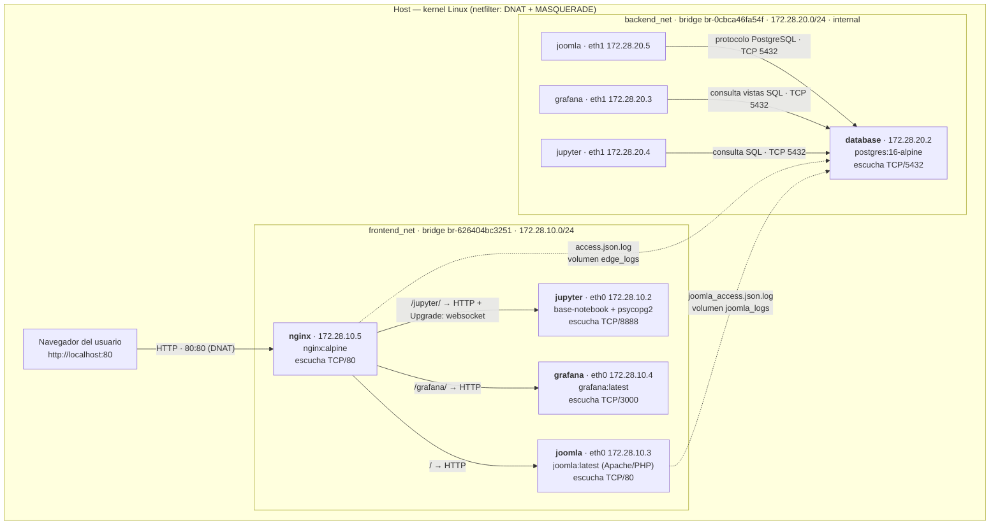

# Informe técnico — Despliegue multi-contenedor y análisis del modelo OSI

**Parcial 2 práctico · Comunicaciones · Ingeniería Mecatrónica**
Universidad Militar Nueva Granada — Docente: Ing. Andrés Julián Moreno, M.Sc.

> Todas las trazas, tablas de direcciones, reglas de *netfilter* y salidas de
> comando que aparecen en este documento fueron capturadas del despliegue real
> descrito en [README.md](README.md), no son ejemplos genéricos.

---

## Índice

1. [Topología y flujo de información](#1-topología-y-flujo-de-información)
2. [Análisis detallado del modelo OSI](#2-análisis-detallado-del-modelo-osi-en-la-solución)
3. [Guía de verificación y demostración](#3-guía-de-verificación-y-demostración)
4. [Decisiones de diseño, límites y seguridad](#4-decisiones-de-diseño-límites-y-seguridad)

---

# 1. Topología y flujo de información

## 1.1 Diagrama de arquitectura



Versión en texto plano (por si el visor no renderiza Mermaid):

```
                     Navegador  ──HTTP/80──►  [ host :80 ]
                                                   │  DNAT → 172.28.10.5:80
 ═══════════════ frontend_net · br-626404bc3251 · 172.28.10.0/24 ═══════════════
                                                   ▼
                                 ┌──────────────────────────────┐
                                 │ nginx  172.28.10.5  (TCP 80) │  ← único puerto publicado
                                 └───┬───────────┬───────────┬──┘
                    /                │  /jupyter/│  /grafana/│
            ┌───────▼────────┐ ┌─────▼────────┐ ┌▼─────────────┐
            │ joomla  .10.3  │ │ jupyter .10.2│ │ grafana .10.4│
            │ Apache TCP 80  │ │ Lab TCP 8888 │ │ HTTP TCP 3000│
            └───────┬────────┘ └─────┬────────┘ └┬─────────────┘
                    │ eth1           │ eth1      │ eth1
 ═══════ backend_net · br-0cbca46fa54f · 172.28.20.0/24 · internal (sin NAT) ═══
                    │ .20.5          │ .20.4     │ .20.3
                    └────────────────┴─────┬─────┘
                                 TCP 5432  │
                              ┌────────────▼─────────────┐
                              │ database  172.28.20.2    │  PostgreSQL 16
                              │ sin ruta por defecto     │
                              └──────────────────────────┘
```

## 1.2 Inventario de los cinco contenedores

| # | Servicio | Imagen | Redes (IP) | Puerto que escucha | Publicado al host | Volúmenes |
|---|---|---|---|---|---|---|
| 1 | `nginx` | `nginx:alpine` | frontend (172.28.10.5) | 80/tcp | **80:80** | `edge_logs` → `/var/log/nginx/shared`, config (ro) |
| 2 | `joomla` | `joomla:latest` (Joomla 6.1.3, Apache 2.4.68, PHP 8.4) | frontend (172.28.10.3) + backend (172.28.20.5) | 80/tcp | no | `joomla_data` → `/var/www/html`, `joomla_logs` → `/var/log/apache2` |
| 3 | `database` | `postgres:16-alpine` (PostgreSQL 16.15) | **solo** backend (172.28.20.2) | 5432/tcp | no | `pgdata` → `/var/lib/postgresql/data`, logs en **solo lectura** |
| 4 | `jupyter` | build sobre `jupyter/base-notebook` | frontend (172.28.10.2) + backend (172.28.20.4) | 8888/tcp | no | bind-mount `./jupyter/notebooks` → `/home/jovyan/work`, logs (ro) |
| 5 | `grafana` | `grafana/grafana:latest` (13.2.2) | frontend (172.28.10.4) + backend (172.28.20.3) | 3000/tcp | no | `grafana_data`, `./grafana/provisioning` (ro) |

Las direcciones provienen de `docker network inspect`; los rangos están fijados
en `docker-compose.yml` mediante bloques `ipam`, de modo que se repiten
idénticos en cualquier máquina.

## 1.3 Mecanismo de recolección: ¿cómo llegan los eventos a Grafana?

Es la pieza central del diseño. **No se usa ningún agente externo** (Promtail,
Fluentd, Filebeat) ni un sexto contenedor: es el propio motor PostgreSQL el que
actúa de colector, de modo que el despliegue conserva exactamente cinco
servicios y una sola fuente de datos para Grafana.

### Paso 1 — Los productores escriben JSON estructurado

`nginx/conf.d/default.conf` define un `log_format` con `escape=json` y lo
escribe simultáneamente en la salida estándar (para `docker compose logs`) y en
el volumen compartido:

```nginx
access_log /var/log/nginx/access.log main;                     # docker logs
access_log /var/log/nginx/shared/access.json.log edge_json;    # volumen edge_logs
```

Línea real producida por el despliegue:

```json
{"ts":"2026-09-19T23:45:01-05:00","remote_addr":"127.0.0.1","xff":"","host":"127.0.0.1",
 "metodo":"GET","uri":"/healthz","args":"","protocolo":"HTTP/1.1","status":200,"bytes":8,
 "request_time":0.000,"upstream_addr":"","upstream_status":"","upstream_time":"",
 "servicio":"edge","upgrade":"","referer":"","user_agent":"Wget"}
```

El campo `servicio` no existe en Nginx: se crea con `set $servicio "joomla";`
dentro de cada `location`, de forma que cada línea del log ya sabe a qué backend
fue enrutada. Eso permite graficar el reparto de tráfico sin analizar la URI.

Joomla hace lo mismo desde Apache (`joomla/apache/zz-observabilidad.conf`):

```json
{"ts":"2026-09-19T23:45:07-0500","remote_addr":"127.0.0.1","proxy_addr":"127.0.0.1",
 "xff":"-","host":"127.0.0.1","metodo":"GET","uri":"/index.php","query":"",
 "protocolo":"HTTP/1.1","status":200,"bytes":7693,"duracion_us":61780,
 "referer":"-","user_agent":"curl/8.14.1"}
```

### Paso 2 — Los volúmenes se comparten en solo lectura

```yaml
database:
  volumes:
    - edge_logs:/mnt/logs/edge:ro
    - joomla_logs:/mnt/logs/joomla:ro
```

El contenedor `database` ve los archivos pero **no puede modificarlos**; el flag
`:ro` se aplica en el *mount namespace*, no depende de permisos POSIX.

### Paso 3 — PostgreSQL los convierte en filas

`database/initdb/01-observabilidad.sql` crea dos funciones `SECURITY DEFINER`:

* `observabilidad.leer_lineas(ruta, max_bytes)` — obtiene el tamaño con
  `pg_stat_file()` y lee **solo la cola** del archivo con `pg_read_file()`
  (8 MiB por defecto), descartando la primera línea si el offset la cortó. El
  costo de cada consulta queda acotado aunque el log crezca indefinidamente.
* `observabilidad.leer_json(ruta)` — convierte cada línea a `jsonb` dentro de un
  bloque `BEGIN … EXCEPTION WHEN others THEN NULL; END`, de modo que una línea a
  medio escribir (Nginx puede estar escribiendo mientras se lee) no invalida la
  consulta completa.

`SECURITY DEFINER` es necesario porque `pg_read_file()` sobre rutas absolutas
exige privilegios de superusuario; encapsularlo en una función permite que el
rol de Grafana lea los logs **sin ser superusuario**.

### Paso 4 — Vistas SQL

| Vista | Contenido |
|---|---|
| `observabilidad.nginx_access` | una fila por petición atendida por el edge |
| `observabilidad.joomla_access` | una fila por petición servida por Apache/Joomla |
| `observabilidad.trafico` | unión homogénea de ambas |
| `observabilidad.actividad_bd` | `pg_stat_database`: conexiones, transacciones, *cache hit* |
| `observabilidad.tablas_joomla` | tamaño y actividad de las tablas que creó el CMS |

### Paso 5 — Grafana consulta con un rol de solo lectura

`database/initdb/02-rol-grafana.sh` crea `grafana_ro`: sin permisos de
escritura, con `SELECT` sobre las vistas y las tablas del CMS (incluidas las
futuras, vía `ALTER DEFAULT PRIVILEGES`), pertenencia a `pg_monitor` y
`statement_timeout = 30s` para que ningún panel pueda bloquear al CMS.

`grafana/provisioning/datasources/datasource.yml` declara el datasource
apuntando a `database:5432` con ese rol, y
`grafana/provisioning/dashboards/dashboard.yml` carga el dashboard de 12 paneles
desde disco en cada arranque. Nada de esto se toca por la interfaz gráfica.

### Resumen del camino

```
nginx  ──┐                          ┌── pg_read_file() ──┐
         ├─► volumen compartido ──► │   parseo JSONB     │ ──► vistas SQL ──► Grafana
joomla ──┘        (rw → ro)         └── SECURITY DEFINER ┘        (rol grafana_ro)
                                                                       │
                                                                       └──► Jupyter
```

**Ventaja:** una sola fuente de datos, sin procesos adicionales, y los mismos
datos disponibles para Grafana y para el cuaderno de Python.
**Costo:** cada refresco vuelve a parsear la cola del archivo; es adecuado para
la escala de este laboratorio, no para producción a gran volumen (ver § 4.3).

## 1.4 Recorrido completo de una petición

Al abrir `http://localhost/index.php`:

1. **Host.** El kernel recibe el SYN en `:80` y aplica la regla DNAT
   `-A DOCKER -p tcp --dport 80 -j DNAT --to-destination 172.28.10.5:80`.
2. **Bridge frontend.** La trama entra a `br-626404bc3251` y sale por el `veth`
   del contenedor `nginx`.
3. **Nginx (Capa 7).** Termina la conexión TCP del cliente, analiza la línea de
   petición y las cabeceras, escoge el `location /`, resuelve `joomla` vía
   `127.0.0.11` y abre **una nueva conexión TCP** hacia `172.28.10.3:80`
   inyectando `Host`, `X-Real-IP`, `X-Forwarded-For`, `X-Forwarded-Proto`.
4. **Apache/PHP.** `mod_remoteip` sustituye la IP de conexión por la del cliente
   real, PHP ejecuta Joomla y abre **otra conexión TCP** hacia `172.28.20.2:5432`
   por su interfaz `eth1` (backend).
5. **PostgreSQL.** Autentica, ejecuta las consultas y devuelve las filas usando
   su protocolo binario de mensajes.
6. **Vuelta.** La respuesta HTML recorre el camino inverso; Apache y Nginx
   escriben cada uno su línea de log JSON, que segundos después aparece en los
   paneles de Grafana.

---

# 2. Análisis detallado del modelo OSI en la solución

## 2.1 Capa 7 — Aplicación

### 2.1.1 Cabeceras HTTP que inyecta Nginx

Al terminar la conexión del cliente y abrir otra hacia el backend, el proxy
**rompe la información de origen**: sin cabeceras adicionales, Joomla creería
que todas las visitas provienen de `172.28.10.5`. Por eso el bloque `server`
declara:

```nginx
proxy_set_header Host              $host;
proxy_set_header X-Real-IP         $remote_addr;
proxy_set_header X-Forwarded-For   $proxy_add_x_forwarded_for;
proxy_set_header X-Forwarded-Proto $scheme;
proxy_set_header X-Forwarded-Host  $host;
proxy_set_header X-Forwarded-Port  $server_port;
```

| Cabecera | Qué transporta | Por qué importa aquí |
|---|---|---|
| `Host` | el nombre pedido por el cliente (`localhost`) | Joomla construye URLs absolutas y decide el *virtual host*; si se enviara `joomla` (el nombre interno), los enlaces del portal apuntarían a un host inexistente para el navegador |
| `X-Real-IP` | IP del cliente, valor único | formato simple para registros y listas de control |
| `X-Forwarded-For` | cadena `cliente, proxy1, proxy2…` | `$proxy_add_x_forwarded_for` **añade** `$remote_addr` al valor que ya venía, preservando la traza completa de proxies |
| `X-Forwarded-Proto` | `http` o `https` | permite al CMS saber si el usuario habló en claro o cifrado aunque el tramo interno sea HTTP |
| `X-Forwarded-Host` / `-Port` | host y puerto originales | reconstrucción exacta de la URL pública |

Del lado de Joomla, `mod_remoteip` cierra el círculo:

```apache
RemoteIPHeader X-Forwarded-For
RemoteIPInternalProxy 172.28.10.0/24
RemoteIPInternalProxy 172.28.20.0/24
```

El módulo solo acepta la cabecera si la conexión viene de un proxy declarado
como interno —de lo contrario cualquier cliente podría falsificar su IP—. El
efecto es comprobable en el log del CMS: `remote_addr` guarda la IP del
navegador y `proxy_addr` la del contenedor Nginx.

> **Nota de seguridad.** `X-Forwarded-For` es autodeclarativa: solo es confiable
> porque el único camino de entrada es el edge y porque Apache restringe la
> confianza a los dos bridges del despliegue.

### 2.1.2 HTTP Upgrade: los WebSockets del kernel de Jupyter

JupyterLab carga el documento por HTTP, pero la ejecución de celdas viaja por un
WebSocket permanente hacia `/api/kernels/<id>/channels`. El cambio de protocolo
se negocia con el mecanismo **Upgrade** de HTTP/1.1 (RFC 7230 §6.7 / RFC 6455):

```
GET /jupyter/api/kernels/<id>/channels HTTP/1.1
Host: localhost
Upgrade: websocket
Connection: Upgrade
Sec-WebSocket-Key: <16 bytes en base64>
Sec-WebSocket-Version: 13
```

El servidor responde `101 Switching Protocols` y, a partir de ese punto, la
misma conexión TCP transporta tramas WebSocket bidireccionales en lugar de
mensajes HTTP.

Para que el proxy no rompa la negociación hacen falta tres piezas:

```nginx
map $http_upgrade $connection_upgrade {   # 1) Connection depende de Upgrade
    default upgrade;
    ''      close;
}

proxy_http_version 1.1;                   # 2) HTTP/1.0 no define Upgrade
proxy_set_header Upgrade    $http_upgrade;
proxy_set_header Connection $connection_upgrade;

proxy_read_timeout 86400s;                # 3) el canal queda inactivo largos ratos
proxy_buffering    off;
```

`Connection` es una cabecera *hop-by-hop*: Nginx la elimina por defecto, así que
debe regenerarse explícitamente. El `map` evita el error clásico de escribir
`Connection: upgrade` fijo, lo que corrompería las peticiones HTTP normales.

**Verificación real sobre el despliegue** (`scripts` de prueba, § 3.4):

```
HTTP/1.1 101 Switching Protocols
Server: nginx/1.31.6
Connection: upgrade
Upgrade: websocket
Sec-Websocket-Accept: SlsiueHzV0/gr2CDQFcMOd8EA2c=
```

El valor `Sec-WebSocket-Accept` es el SHA-1 de la clave del cliente concatenada
con el GUID de la RFC 6455, codificado en base64: su presencia demuestra que
quien contestó fue el servidor Jupyter y no el proxy.

Además, `c.ServerApp.base_url = "/jupyter"` hace que el propio servidor genere
las URL de los WebSockets con el prefijo correcto; sin eso, el navegador
intentaría abrir `ws://localhost/api/kernels/...` y recibiría el portal Joomla.

### 2.1.3 Publicación bajo subdirectorio: dos estrategias

Jupyter y Grafana se sirven bajo un prefijo, pero la URI **no se reescribe** en
el proxy: `proxy_pass http://$upstream;` sin componente de ruta entrega la URI
original intacta. Es cada aplicación la que se declara montada en su prefijo:

| Servicio | Mecanismo | Efecto |
|---|---|---|
| Jupyter | `c.ServerApp.base_url = "/jupyter"` | genera enlaces, assets y URLs de WebSocket ya prefijados |
| Grafana | `GF_SERVER_ROOT_URL` + `GF_SERVER_SERVE_FROM_SUB_PATH=true` | emite `<base href="/grafana/" />` y resuelve sus assets relativos a esa base |

Reescribir el prefijo en Nginx (`rewrite ^/grafana/(.*) /$1 break;`) sería el
error típico: la aplicación respondería, pero devolvería HTML con rutas
absolutas hacia `/public/build/...`, que el edge entregaría a Joomla.

Dos detalles de comodidad añadidos en el edge:

```nginx
location = /grafana  { return 301 /grafana/; }                       # normaliza la barra final
location = /grafana/ { return 302 /grafana/d/parcial2-observabilidad/; }  # aterriza en el dashboard
```

La segunda regla existe porque la página de inicio propia de Grafana 13 exige
permisos que el rol anónimo no tiene; redirigir en el edge evita depender de la
base de datos interna de Grafana y mantiene la configuración declarativa.

### 2.1.4 Protocolo de aplicación de PostgreSQL

PostgreSQL no habla HTTP: usa un **protocolo binario propio sobre TCP/5432**
(*frontend/backend protocol* v3.0), orientado a mensajes con el formato
`[tipo: 1 byte][longitud: 4 bytes][carga útil]`.

Secuencia de una sesión, tal como la ejecutan Joomla, Grafana y Jupyter:

| Fase | Mensajes | Observación |
|---|---|---|
| Arranque | `StartupMessage` (usuario, base, parámetros) | no lleva byte de tipo, es el único caso |
| Autenticación | `AuthenticationSASL` / `AuthenticationOk` | PostgreSQL 16 usa SCRAM-SHA-256 por defecto |
| Preparación | `ParameterStatus`, `BackendKeyData`, `ReadyForQuery` | el servidor anuncia codificación, zona horaria, etc. |
| Consulta simple | `Query` → `RowDescription`, `DataRow`…, `CommandComplete`, `ReadyForQuery` | lo que usan los paneles con SQL crudo |
| Consulta extendida | `Parse`, `Bind`, `Describe`, `Execute`, `Sync` | sentencias preparadas con parámetros (psycopg2, PDO) |
| Cierre | `Terminate` | libera el *backend process* |

Cada conexión ocupa **un proceso** del lado servidor, lo que explica por qué el
*pooling* importa (§ 2.2.2). Comprobación desde el cuaderno de Jupyter:

```
PostgreSQL 16.15 on x86_64-pc-linux-musl ...
Servidor (socket destino)   : 172.28.20.2/32:5432
Cliente  (este contenedor)  : 172.28.20.4/32
```

Ambos extremos están en `backend_net`: el tráfico SQL nunca toca la red de
borde.

### 2.1.5 Formato y estructura de los logs de Joomla

Apache 2.4 admite formatos arbitrarios con `LogFormat`. El despliegue mantiene
**dos salidas simultáneas**:

| Destino | Formato | Uso |
|---|---|---|
| `/var/log/apache2/access.log` (enlace a `/dev/stdout`) | `combined` | inspección humana con `docker compose logs joomla` |
| `/var/log/apache2/joomla_access.json.log` | JSON personalizado | consumo automático por PostgreSQL/Grafana |

El formato `combined` clásico es:

```
%a %l %u %t "%r" %>s %O "%{Referer}i" "%{User-Agent}i"
172.28.10.5 - - [19/Sep/2026:23:45:07 -0500] "GET /index.php HTTP/1.1" 200 7693 "-" "curl/8.14.1"
```

Sus dos problemas para el análisis automático son la fecha entre corchetes con
mes en inglés y el uso de `-` como marcador de campo vacío. El formato JSON los
elimina:

| Directiva | Campo | Significado |
|---|---|---|
| `%{%Y-%m-%dT%H:%M:%S%z}t` | `ts` | marca temporal ISO 8601 con desplazamiento |
| `%a` / `%{c}a` | `remote_addr` / `proxy_addr` | IP real del cliente (tras `mod_remoteip`) / IP de la conexión TCP |
| `%m`, `%U`, `%q`, `%H` | `metodo`, `uri`, `query`, `protocolo` | línea de petición descompuesta |
| `%>s` | `status` | código final, tras redirecciones internas |
| `%B` | `bytes` | cuerpo enviado (`0` en lugar de `-`) |
| `%D` | `duracion_us` | tiempo de servicio en microsegundos |

Un detalle importante: Apache escapa las comillas dentro de los valores de
cabecera, pero usa secuencias `\xHH` que **no** son JSON válido. Por eso el
parser en PostgreSQL descarta silenciosamente las líneas que no convierten, en
vez de fallar. En la ejecución de referencia: `líneas válidas: 94, descartadas: 0`.

Joomla, además, tiene su propio registro de aplicación en
`/var/www/html/administrator/logs/`, útil para auditar el CMS; el análisis de
tráfico de este parcial se apoya en los dos access logs, que son los que
registran cada petición.

## 2.2 Capa 4 — Transporte

### 2.2.1 Puertos y sockets involucrados

| Proceso | Socket de escucha | Alcanzable desde | Publicado al host |
|---|---|---|---|
| Nginx | `0.0.0.0:80` | cualquier origen | **sí**, `80:80` |
| Apache (Joomla) | `0.0.0.0:80` | solo `frontend_net` | no |
| PostgreSQL | `0.0.0.0:5432` | solo `backend_net` | no |
| Jupyter Server | `0.0.0.0:8888` | solo `frontend_net` | no |
| Grafana | `0.0.0.0:3000` | solo `frontend_net` | no |

Aunque los procesos escuchen en `0.0.0.0`, el contenedor solo tiene interfaces
en las redes que Compose le asignó: la superficie real de exposición la define
la topología de Capa 3, no el `bind`. La única regla DNAT existente es la del
puerto 80, verificable con `iptables -t nat -S DOCKER`:

```
-A DOCKER -p tcp -m tcp --dport 80 -j DNAT --to-destination 172.28.10.5:80
```

No hay ninguna regla equivalente para 5432, 8888 ni 3000.

### 2.2.2 Conexiones concurrentes y persistentes

Una sola visita al portal abre **tres conexiones TCP distintas**, cada una con
su propio *three-way handshake* (SYN → SYN/ACK → ACK):

```
navegador ──(1)──► nginx ──(2)──► apache ──(3)──► postgres
```

**(1) Navegador ↔ Nginx.** HTTP/1.1 usa `keep-alive` por defecto: el navegador
reutiliza la misma conexión para el HTML, el CSS, las imágenes y las peticiones
AJAX, ahorrando un *handshake* y el arranque lento de TCP por cada recurso.
Nginx la mantiene abierta 75 s (`keepalive_timeout` por defecto).

**(2) Nginx ↔ backends.** El despliegue usa resolución dinámica:

```nginx
resolver 127.0.0.11 valid=10s ipv6=off;
set $upstream_joomla joomla:80;
proxy_pass http://$upstream_joomla;
```

Con `proxy_pass` sobre una variable, el nombre se resuelve **en cada petición**
(con caché de 10 s), de modo que si un backend se reinicia y cambia de IP el
proxy se recupera solo; con un bloque `upstream` estático, Nginx resuelve el
nombre al arrancar y conservaría una IP obsoleta hasta un `reload`.

*Contrapartida asumida conscientemente:* al no existir bloque `upstream`, no hay
`keepalive` hacia los backends y cada petición abre una conexión TCP nueva. Para
la escala del laboratorio el costo es despreciable (latencia p50 medida:
**19 ms**); en producción se preferiría un `upstream` con `keepalive 32` y un
mecanismo de recarga de DNS.

**(3) Aplicación ↔ PostgreSQL.** Aquí conviven dos modelos opuestos:

| Cliente | Modelo | Evidencia |
|---|---|---|
| Joomla (PHP) | conexión **por petición**: PHP abre, consulta y cierra al terminar el script | `netstat` en el contenedor `database` muestra decenas de sockets en `TIME_WAIT` hacia 5432 |
| Grafana (Go) | **pool persistente** (`maxOpenConns: 5`, `maxIdleConns: 2`, `connMaxLifetime: 14400`) | `pg_stat_activity` muestra un backend `idle` de `172.28.20.3` esperando la siguiente consulta |
| Jupyter (SQLAlchemy) | pool con `pool_pre_ping=True` | valida la conexión antes de reutilizarla, evitando errores por sockets caducados |

```
 client_addr | application_name | state  |  backend_type
-------------+------------------+--------+----------------
 172.28.20.3 |                  | idle   | client backend     ← Grafana, conexión persistente
             | psql             | active | client backend
```

El estado `TIME_WAIT` (2·MSL, típicamente 60 s en Linux) es el precio del cierre
ordenado: el extremo que cierra activamente retiene el par de puertos para
descartar segmentos retrasados de la conexión anterior. Con cientos de
peticiones por segundo ese comportamiento agotaría puertos efímeros, y ahí es
donde el *pooling* deja de ser una optimización para volverse un requisito.

**WebSockets.** El canal del kernel de Jupyter es el caso extremo: **una** conexión
TCP que permanece abierta durante toda la sesión. Por eso el `location /jupyter/`
eleva `proxy_read_timeout` a 86 400 s y desactiva `proxy_buffering`; con los
valores por defecto (60 s) el proxy cerraría el túnel durante cualquier pausa y
JupyterLab mostraría *"Kernel connection error"*.

## 2.3 Capa 3 — Red

### 2.3.1 Direccionamiento y aislamiento

| Red | Bridge | Subred | Gateway | `internal` | Miembros |
|---|---|---|---|---|---|
| `frontend_net` | `br-626404bc3251` | 172.28.10.0/24 | 172.28.10.1 | no | nginx, joomla, jupyter, grafana |
| `backend_net` | `br-0cbca46fa54f` | 172.28.20.0/24 | 172.28.20.1 | **sí** | joomla, jupyter, grafana, database |

`joomla`, `jupyter` y `grafana` son **multihomed**: tienen una interfaz en cada
bridge y actúan de puente lógico entre el plano de borde y el plano de datos.
`nginx` solo existe en el borde y `database` solo en el plano de datos: no
comparten ninguna red, por lo que **ninguna trama puede ir directamente de uno
al otro**.

El aislamiento es verificable en tres niveles distintos:

```bash
# (a) Capa 7/3 — el edge ni siquiera puede resolver el nombre
$ docker exec comm_nginx ping -c1 database
ping: bad address 'database'

# (b) Capa 3 — el motor no tiene ruta por defecto: solo su propio enlace
$ docker exec comm_database ip route show
172.28.20.0/24 dev eth0 scope link src 172.28.20.2

# (c) Capa 3 — sin salida a Internet (no hay MASQUERADE para su subred)
$ docker exec comm_database wget -q -O /dev/null http://deb.debian.org
wget: bad address 'deb.debian.org'     (exit=1)
```

La salida (b) es la prueba más contundente de `internal: true`: mientras los
contenedores del borde tienen una ruta `default via 172.28.10.1`, la tabla de
rutas de `database` **solo contiene la red local**. Cualquier destino fuera de
172.28.20.0/24 es inalcanzable por falta de siguiente salto.

> Nota: el *bridge* `backend_net` sí tiene una dirección de gateway
> (172.28.20.1), porque Docker siempre asigna una al bridge del host; lo que
> `internal: true` suprime es la ruta por defecto dentro de los contenedores y
> las reglas de NAT de salida.

### 2.3.2 DNS embebido de Docker (127.0.0.11)

Cada contenedor recibe un `/etc/resolv.conf` apuntando al resolvedor interno:

```
nameserver 127.0.0.11
options timeout:2 attempts:3 ndots:0
```

Esa dirección es una *loopback* especial: Docker inserta en el *network
namespace* del contenedor reglas de NAT que redirigen el tráfico DNS hacia un
servidor que corre en el demonio. El resolvedor:

1. responde por **nombre de servicio**, **nombre de contenedor** y **alias** de
   red, con registros A de vida corta;
2. **solo resuelve nombres de contenedores que comparten al menos una red con
   quien pregunta** — la resolución es, en sí misma, un control de acceso;
3. reenvía al DNS del host lo que no conoce (`deb.debian.org`), salvo en redes
   `internal`, donde esa consulta también falla.

Contraste medido en el despliegue:

```bash
$ docker exec comm_jupyter getent hosts database nginx
172.28.20.2     database          # jupyter está en backend_net → lo ve
172.28.10.5     nginx             # y también en frontend_net

$ docker exec comm_nginx nslookup database
;; connection timed out; no servers could be reached     # nginx no comparte red con él
```

Gracias a esto, `docker-compose.yml`, `default.conf`, `datasource.yml` y el
cuaderno de Jupyter usan **nombres lógicos** (`database`, `joomla`, `grafana`) y
jamás direcciones IP: las IP pueden cambiar en cada despliegue sin romper nada.

### 2.3.3 Reenvío y NAT administrados por el kernel del host

El host actúa como router entre el mundo exterior y los bridges. Las reglas
relevantes, capturadas con `iptables -t nat -S`:

```
# DNAT de entrada: puerto publicado → contenedor nginx
-A DOCKER -p tcp -m tcp --dport 80 -j DNAT --to-destination 172.28.10.5:80

# SNAT/MASQUERADE de salida, solo para la red de borde
-A POSTROUTING -s 172.28.10.0/24 ! -o br-626404bc3251 -j MASQUERADE
```

Tres consecuencias:

1. **Entrada.** Un SYN al puerto 80 del host se reescribe a `172.28.10.5:80`
   antes del enrutamiento; `conntrack` recuerda la traducción para deshacerla en
   la respuesta. El cliente cree hablar con el host; Nginx ve la IP del cliente
   (o la del gateway, según el escenario de red).
2. **Salida.** Los contenedores del borde salen a Internet enmascarados tras la
   IP del host; por eso Joomla puede actualizar extensiones y Grafana descargar
   plugins.
3. **Ausencia significativa.** **No existe ninguna regla `MASQUERADE` para
   172.28.20.0/24.** El kernel no tiene cómo traducir el tráfico saliente del
   plano de datos, que queda confinado a su bridge. Es la contraparte, del lado
   del host, de lo que la tabla de rutas mostraba desde dentro.

Todo esto requiere `net.ipv4.ip_forward=1`, que el demonio Docker habilita al
crear el primer bridge.

## 2.4 Capa 2 — Enlace de datos

### 2.4.1 veth y bridges

Cada conexión de un contenedor a una red es un **par `veth`**: dos interfaces
Ethernet virtuales unidas como los extremos de un cable. Un extremo vive en el
*network namespace* del contenedor (allí se llama `eth0`, `eth1`, …); el otro
queda en el host, esclavizado a un bridge. Lo que entra por un extremo sale por
el otro.

Estado real del despliegue:

```bash
$ for b in /sys/class/net/br-*; do echo "$(basename $b) → $(ls $b/brif)"; done
br-626404bc3251  mac=ca:02:54:f5:98:5b  miembros: veth15caeff veth3dc232a veth5286d34 vethfc3eb47
br-0cbca46fa54f  mac=2e:98:f3:9f:e6:f0  miembros: veth4d3d165 veth50934c0 veth6106c7d veth8444407
```

Cuatro `veth` por bridge, coincidiendo exactamente con los cuatro contenedores
de cada red. El bridge es un **conmutador Ethernet por software**: mantiene una
tabla de MAC aprendidas por puerto e inunda solo las tramas de difusión o de
destino desconocido. Cada bridge es, por tanto, un **dominio de difusión
independiente**, y esa es la frontera física —en términos virtuales— entre
`frontend_net` y `backend_net`.

Un contenedor multihomed como `joomla` tiene dos interfaces con MAC distintas:

```bash
$ docker exec comm_joomla sh -c 'hostname -I; cat /sys/class/net/eth*/address'
172.28.10.3 172.28.20.5
6a:8e:20:37:c7:19      # eth0 → br-626404bc3251 (frontend)
42:95:89:9a:0c:48      # eth1 → br-0cbca46fa54f (backend)
```

La decisión de qué interfaz usar es de Capa 3: al hablar con `172.28.20.2` la
tabla de rutas elige `eth1` porque esa red está directamente conectada.

### 2.4.2 Resolución ARP entre contenedores del mismo bridge

Dos contenedores de la misma red están en la **misma subred**, así que no hay
enrutamiento entre ellos: la pila necesita la MAC del destino y emite una
petición ARP en difusión (`who-has 172.28.10.3, tell 172.28.10.5`), que el
bridge propaga a todos sus puertos. El destino contesta en unidifusión y la
asociación IP↔MAC queda en caché.

Tabla ARP real de `nginx` tras servir tráfico:

```bash
$ docker exec comm_nginx arp -a
? (172.28.10.1) at ca:02:54:f5:98:5b [ether] on eth0                                  ← gateway (el bridge)
comm_joomla.parcial2_frontend_net  (172.28.10.3) at 6a:8e:20:37:c7:19 [ether] on eth0
comm_jupyter.parcial2_frontend_net (172.28.10.2) at e2:90:0e:49:c6:3f [ether] on eth0
comm_grafana.parcial2_frontend_net (172.28.10.4) at 42:8d:2c:ea:9f:ff [ether] on eth0
```

Tres observaciones:

* `nginx` aprendió la MAC de sus tres backends —y de ninguno más—: **no hay
  ninguna entrada de 172.28.20.x**, porque esas direcciones son inalcanzables a
  nivel de enlace desde este bridge.
* La primera entrada es el gateway, cuya MAC `ca:02:54:f5:98:5b` coincide con la
  del propio bridge `br-626404bc3251`: confirma que el gateway de la red es la
  interfaz del host en ese conmutador virtual.
* Las direcciones MAC comienzan por bytes con el bit *locally administered*
  activo; son generadas por Docker, no asignadas por un fabricante.

Un `docker compose down && up` cambia todas las MAC y posiblemente las IP; el
sistema sigue funcionando porque ninguna configuración las menciona: ARP y el
DNS interno reconstruyen el mapa completo en cada arranque.

---

# 3. Guía de verificación y demostración

Procedimiento completo, en el mismo orden que exige el enunciado. Tiempo
estimado: 10 minutos.

## 3.0 Despliegue

```bash
git clone <URL_DEL_REPOSITORIO>
cd <CARPETA_DEL_REPOSITORIO>
cp .env.example .env
docker compose up -d
```

Esperar a que los cinco contenedores estén `healthy`:

```bash
docker compose ps
```

```
NAME            STATUS
comm_database   Up (healthy)
comm_joomla     Up (healthy)
comm_jupyter    Up (healthy)
comm_grafana    Up (healthy)
comm_nginx      Up (healthy)
```

> La primera vez, `comm_joomla` tarda 1–3 minutos en ponerse `healthy` porque
> instala el CMS de forma desatendida. `docker compose logs -f joomla` debe
> terminar mostrando `[OK] Joomla has been installed`.

## 3.1 Portal Joomla a través de Nginx, y generación de tráfico

1. Abrir <http://localhost/> → portada del portal institucional servida por
   Joomla **a través del proxy** (el navegador nunca habla con el puerto 80 del
   contenedor Joomla, que no está publicado).
2. Navegar el sitio: entrar a varios artículos, al formulario de acceso
   (`/index.php?option=com_users&view=login`) y a una URL inexistente para
   provocar un 404.
3. Entrar al backend en <http://localhost/administrator/> con
   `administrador` / `Comm2026_Joomla_Admin`.
4. Para producir volumen suficiente de una sola vez:

```bash
./scripts/generar_trafico.sh 15                         # Linux/macOS/Git Bash
powershell -File scripts\generar_trafico.ps1 -Vueltas 15   # Windows
```

5. Comprobar que el edge está registrando:

```bash
docker compose exec nginx tail -2 /var/log/nginx/shared/access.json.log
```

## 3.2 Grafana: los paneles reflejan el tráfico

1. Abrir <http://localhost/grafana/>. **No se pide usuario** (el acceso anónimo
   de solo lectura está habilitado) y el edge redirige esa ruta directamente al
   dashboard aprovisionado, así que los paneles aparecen sin navegar por menús.
   Para administrar: `admin` / `Comm2026_Grafana`.
2. Verificar que el aprovisionamiento ocurrió sin intervención:
   *Connections → Data sources* muestra **PostgreSQL-Observabilidad**
   (no editable, marcado como *provisioned*), y *Dashboards* muestra la carpeta
   **Parcial 2 - Comunicaciones**.
3. Seleccionar el rango **Last 15 minutes** y confirmar:

| Panel | Qué debe verse |
|---|---|
| Peticiones atendidas por el edge | número total > 0 |
| Peticiones por minuto, por servicio enrutado | barras apiladas con `joomla`, `jupyter`, `grafana`, `edge` |
| Peticiones por minuto, por clase de código HTTP | serie `2xx` y, tras visitar una URL inexistente, `4xx` |
| Latencia del edge (p50 y p95) | dos curvas en segundos |
| Peticiones servidas por Apache/Joomla | barras alimentadas por el log del **CMS** |
| Recursos más solicitados / Clientes más activos | tablas con URIs e IPs reales |
| Tablas del CMS en PostgreSQL | `joom_extensions`, `joom_guidedtour_steps`, … |

4. Recargar el portal en otra pestaña y observar cómo suben los contadores en el
   siguiente refresco (30 s).

Comprobación equivalente por consola:

```bash
docker compose exec database psql -U joomla -d joomladb \
  -c "SELECT servicio, count(*) FROM observabilidad.nginx_access GROUP BY 1 ORDER BY 2 DESC;"
```

```
 servicio | count
----------+-------
 edge     |     9
 joomla   |     6
 jupyter  |     3
 grafana  |     3
```

## 3.3 Jupyter: cuaderno precargado y ejecución de celdas

1. Abrir <http://localhost/jupyter/>. JupyterLab arranca **sin token** y abre
   directamente `work/analisis_datos.ipynb`.
2. Menú *Run → Run All Cells*. Todas las celdas deben completarse sin error; la
   ejecución tarda menos de un minuto.
3. Qué demuestra cada sección:

| Sección del cuaderno | Resultado esperado |
|---|---|
| 1 · DNS y puertos | tabla con los 5 servicios, sus IP y `abierto (SYN/ACK)` |
| 2 · Generación de tráfico | 27 peticiones enviadas a través del edge |
| 3 · PostgreSQL | versión del motor, **76 tablas** del CMS, IP de ambos extremos del socket |
| 4 · Vistas SQL | dos gráficas: tráfico por servicio y respuestas por clase HTTP |
| 5 · Log crudo | percentiles de latencia + tercera gráfica |
| 6 · Actividad del motor | conexiones, transacciones y *cache hit ratio* |

4. Validación no interactiva equivalente (ejecuta el cuaderno completo y falla
   si alguna celda lanza una excepción):

```bash
docker compose exec jupyter jupyter nbconvert --to notebook --execute \
  --output /tmp/salida.ipynb work/analisis_datos.ipynb
```

## 3.4 Comprobaciones específicas de red (opcional, para la sustentación)

```bash
# WebSockets operativos: debe responder 101 Switching Protocols
curl -i -s -o - -N --max-time 5 \
  -H "Connection: Upgrade" -H "Upgrade: websocket" \
  -H "Sec-WebSocket-Version: 13" -H "Sec-WebSocket-Key: x3JJHMbDL1EzLkh9GBhXDw==" \
  http://localhost/jupyter/api/kernels 2>/dev/null | head -1

# Aislamiento de la base de datos
docker compose exec nginx ping -c1 database          # bad address
docker compose exec database ip route show           # sin ruta por defecto

# DNS interno
docker compose exec jupyter getent hosts database
docker compose exec jupyter cat /etc/resolv.conf     # nameserver 127.0.0.11

# Capa 2
docker compose exec nginx arp -a                     # MAC de los vecinos del bridge

# NAT del host
docker run --rm --net=host --privileged alpine \
  sh -c 'apk add -q iptables && iptables -t nat -S DOCKER'
```

---

# 4. Decisiones de diseño, límites y seguridad

## 4.1 Por qué PostgreSQL como colector de logs

Las alternativas habituales (Loki + Promtail, Elastic + Filebeat) exigen al
menos un contenedor extra y un segundo datasource. Usar `pg_read_file()` dentro
de funciones `SECURITY DEFINER` mantiene el stack en los cinco servicios que pide
el enunciado, deja **una sola fuente de datos** para Grafana y Jupyter, y hace
que el análisis de logs se escriba en SQL, que es el lenguaje que el resto del
sistema ya habla.

## 4.2 Medidas de seguridad aplicadas

| Medida | Implementación |
|---|---|
| Superficie de exposición mínima | un único puerto publicado (80); los otros cuatro servicios no son alcanzables desde el host |
| Base de datos sin salida | `backend_net` con `internal: true`; sin ruta por defecto ni MASQUERADE |
| Mínimo privilegio en la BD | Grafana usa `grafana_ro`, sin permisos de escritura y con `statement_timeout = 30s` |
| Logs inmutables para el consumidor | los volúmenes se montan `:ro` en `database` y en `jupyter` |
| Confianza acotada en cabeceras | `mod_remoteip` solo acepta `X-Forwarded-For` desde las dos subredes del despliegue |
| Parseo defensivo | las líneas de log malformadas se descartan sin abortar la consulta |
| Configuración inmutable | datasource y dashboard se declaran en archivos; no dependen de la base interna de Grafana |

## 4.3 Límites conocidos (y cómo se resolverían en producción)

| Límite | Impacto | Mitigación en un entorno real |
|---|---|---|
| Sin TLS: todo viaja en HTTP claro | aceptable en laboratorio local | terminar TLS en Nginx (`listen 443 ssl`) y forzar redirección |
| Jupyter sin token y con `allow_origin: "*"` | cualquiera con acceso al puerto 80 ejecuta código Python | token o contraseña, `allow_origin` explícito y autenticación en el edge |
| Acceso anónimo de lectura en Grafana | los paneles son públicos dentro de la máquina | desactivar `GF_AUTH_ANONYMOUS_ENABLED` |
| Credenciales por defecto en `.env.example` | imprescindible para la evaluación en un paso | gestor de secretos (`docker secret`, Vault) |
| Relectura de la cola del log en cada refresco | costo lineal con el tamaño leído (8 MiB máx.) | ingestión incremental a una tabla, o Loki/Promtail |
| Sin `keepalive` hacia los backends | un *handshake* TCP por petición | bloque `upstream` con `keepalive` y recarga de DNS |
| Volumen de logs sin rotación | crecimiento indefinido en despliegues largos | `logrotate` o `access_log` con rotación por tamaño |

## 4.4 Correspondencia con los requisitos del enunciado

| Requisito | Dónde se cumple |
|---|---|
| Despliegue con `docker compose up -d` | `docker-compose.yml` (5 servicios, `depends_on` con `service_healthy`) |
| `.env.example` con credenciales | raíz del repositorio; además, cada variable tiene valor por defecto en el Compose |
| Nginx único puerto publicado, enrutando por prefijo | `nginx/conf.d/default.conf` (`/`, `/jupyter/`, `/grafana/`) |
| WebSockets para Jupyter | `map $http_upgrade`, `proxy_http_version 1.1`, verificado con `101 Switching Protocols` |
| Joomla sobre PostgreSQL | `JOOMLA_DB_TYPE=pgsql`; 76 tablas `joom_*` creadas en `joomladb` |
| Logs de Joomla compartidos | volumen `joomla_logs` montado en `database` y en `jupyter` |
| PostgreSQL `postgres:16-alpine`, aislado, persistente | solo en `backend_net` (`internal`), volumen `pgdata` en `/var/lib/postgresql/data` |
| Cuaderno `.ipynb` precargado y ejecutable | bind-mount `./jupyter/notebooks`; ejecución completa sin errores |
| Grafana con provisioning automático y ≥ 2 gráficas | `grafana/provisioning/**`; 12 paneles, 4 de ellos series temporales |
| Dos redes bridge segmentadas | `frontend_net` y `backend_net` con subredes fijas |
| Informe con análisis OSI (capas 2, 3, 4 y 7) | secciones 2.1 a 2.4 de este documento |
